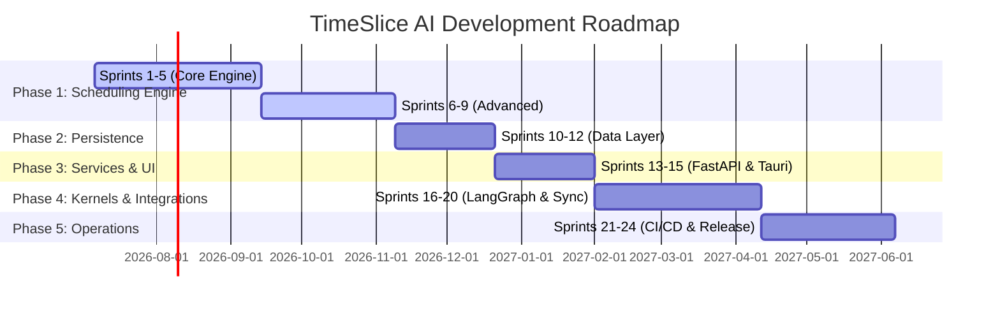

# TimeSlice AI - Development Roadmap & Sprints 🚀

This document details the step-by-step engineering roadmap for building **TimeSlice AI**. It outlines the workload division between **Developer A (Frontend)** and **Developer B (Backend & AI)** for all 5 phases and 24 sprints.

---

## 👥 Team Workload Division & Tech Stack

*   **Developer A (Frontend):** Focuses on Tauri, React, TypeScript, Tailwind CSS, Zustand, and TanStack Query.
*   **Developer B (Backend & AI):** Focuses on FastAPI, SQLAlchemy (SQLite), ChromaDB, LangGraph, and **Nvidia NIM API** (for LLM orchestration).

---

## 🗺️ High-Level Phase Timeline

---

## 📂 Phase 1: Pure Algorithmic Core (Sprints 1–9)
**Goal:** Build a pure, deterministic, and independently testable scheduling engine.
**Developer A (Frontend):** Set up design system tokens, components, and static mockups.
**Developer B (Backend):** Implement the core math, scheduling policies, and metrics in `packages/scheduling-system`.

### Part 1: Core Engine Components (Sprints 1–5)
*Target Namespace:* `packages/scheduling-system/` & `packages/ui/` (boilerplate)

#### Sprint 1: Engine Core Foundation
*   **Developer B (Backend):**
    *   Define shared domain scheduling models (`Process`, `TimeSlice`, `ExecutionPlan`).
    *   Define scheduler interfaces (`ISchedulerPolicy`, `IConstraintEngine`).
    *   Build the `Process Analyzer` to parse input workloads.
    *   Set up unit testing boilerplate in `tests/`.
*   **Developer A (Frontend):**
    *   Initialize Tauri project configuration and template shell.
    *   Define theme design tokens (colors, typography, spacings) in CSS variables.

#### Sprint 2: Policy Manager & Initial Policies
*   **Developer B (Backend):**
    *   Build the central `Policy Manager` for registerable policies.
    *   Implement deterministic `Round Robin` and `Priority Scheduling` policies.
    *   Write policy verification unit tests.
*   **Developer A (Frontend):**
    *   Build foundational UI components (Button, Typography, Input, Card, Tooltip).
    *   Establish UI Storybook or playground for component validation.

#### Sprint 3: Time Quantum & Planning
*   **Developer B (Backend):**
    *   Build the `Time Quantum Manager` to calculate dynamic/static execution slices.
    *   Implement `Execution Planner` to assemble individual time slices into a contiguous execution plan.
*   **Developer A (Frontend):**
    *   Design and build static layout wrappers (Sidebar, Header, Main view area).
    *   Create mock views for the Dashboard.

#### Sprint 4: Rescheduling & Resolution
*   **Developer B (Backend):**
    *   Build the `Conflict Resolver` to handle overlapping calendar constraints.
    *   Implement the `Dynamic Rescheduler` for local replanning when interrupts occur.
*   **Developer A (Frontend):**
    *   Build static layouts for Process CRUD views (creation forms, status lists).
    *   Implement client-side state routing (React Router or simpler switcher).

#### Sprint 5: Simulation & Core Testing
*   **Developer B (Backend):**
    *   Build the `Scheduler Simulator` to run virtual scheduling runs.
    *   Write integration test suites verifying plan generation under simulated workloads.
*   **Developer A (Frontend):**
    *   Build interactive state stores (Zustand) with local dummy data.
    *   Create prototype calendar grid UI components.

---

### Part 2: Advanced Scheduling (Sprints 6–9)
*Target Namespace:* `packages/scheduling-system/` & `packages/ui/` (widgets)

#### Sprint 6: Constraint Engine
*   **Developer B (Backend):**
    *   Implement `Constraint Engine` structure.
    *   Define `HardConstraint` (e.g. fixed events) and `SoftConstraint` (e.g. preferred work hours) interfaces.
    *   Build constraint verification algorithms.
*   **Developer A (Frontend):**
    *   Create UI controls for configuring schedule constraints (sliders, time range pickers).

#### Sprint 7: Advanced Policies
*   **Developer B (Backend):**
    *   Implement `Shortest Job First (SJF)` and `Earliest Deadline First (EDF)` scheduling policies.
    *   Write unit tests validating policy outputs.
*   **Developer A (Frontend):**
    *   Build policy selector components in the UI.
    *   Design cards showing detail explanations of selected policies.

#### Sprint 8: Dynamic Rescheduling
*   **Developer B (Backend):**
    *   Implement the `Dynamic Rescheduler` localized update pipeline.
    *   Build `Impact Analyzer` to evaluate the cognitive impact of rescheduling.
*   **Developer A (Frontend):**
    *   Design interactive dialog prompts for handling rescheduling impacts (e.g., "Review rescheduling conflict").

#### Sprint 9: Scheduling Metrics & Simulator
*   **Developer B (Backend):**
    *   Implement `Attention Debt`, `Attention Equity`, `Deadline Risk`, and `Completion Velocity` metrics.
    *   Implement aggregated `Process Health` computation.
    *   Build policy comparison simulator engine.
*   **Developer A (Frontend):**
    *   Build visualization components for metrics (health status rings, velocity charts using Recharts).

---

## 🗄️ Phase 2: Persistence & Local Storage (Sprints 10–12)
**Goal:** Build the local-first database architecture and memory RAG engines.
**Developer A (Frontend):** Implement offline Zustand state caches and client-side database caching.
**Developer B (Backend):** Configure SQLite repositories and ChromaDB embeddings.

*Target Namespace:* `packages/database/` & `packages/context-vault/`

#### Sprint 10: Relational Schema & Repositories
*   **Developer B (Backend):**
    *   Define SQLAlchemy database models mapping to processes, execution plans, and metrics.
    *   Build repositories for atomic data operations.
    *   Configure Alembic database migration environment.
*   **Developer A (Frontend):**
    *   Implement client-side storage persistence strategies for UI preferences.

#### Sprint 11: Local Database & Vector Store
*   **Developer B (Backend):**
    *   Integrate SQLite database drivers for offline-first relational persistence.
    *   Integrate ChromaDB vector database drivers.
    *   Build vector embedding pipeline for document retrieval.
    *   Create schema migrations.
*   **Developer A (Frontend):**
    *   Create offline warning state UI layers and local cache managers.

#### Sprint 12: Sync Interfaces & Offline Engine
*   **Developer B (Backend):**
    *   Build sync schemas and transaction logs.
    *   Define PostgreSQL cloud synchronization contracts and conflict resolution strategies.
*   **Developer A (Frontend):**
    *   Design the conflict resolution UI panel where users select overrides during sync.

---

## 🔌 Phase 3: Core API Services & Frontend Shell (Sprints 13–15)
**Goal:** Connect the core backend system to web layers and launch API interfaces.
**Developer A (Frontend):** Implement client API connections, Zustand integration, and dynamic routing.
**Developer B (Backend):** Build FastAPI routing, validation DTOs, and resource endpoints.

*Target Namespace:* `apps/backend/` & `apps/desktop/`

#### Sprint 13: FastAPI Infrastructure
*   **Developer B (Backend):**
    *   Set up FastAPI project boilerplate, configuration handlers, and basic routing.
    *   Set up DTO schemas and request body validators.
*   **Developer A (Frontend):**
    *   Initialize Axios/Fetch API client hooks.
    *   Setup TanStack Query provider structure.

#### Sprint 14: Core Resource API Endpoints
*   **Developer B (Backend):**
    *   Build Process CRUD API endpoints.
    *   Build Scheduler API endpoints to fetch execution plans.
    *   Expose Calendar synchronization endpoints.
*   **Developer A (Frontend):**
    *   Bind the Process management UI forms with backend POST/PUT/DELETE endpoints.
    *   Render active scheduler execution plans in the calendar grid.

#### Sprint 15: Security & Kernel Endpoint
*   **Developer B (Backend):**
    *   Implement JWT token validation and secure headers middleware.
    *   Set up Attention Kernel communication API stub endpoints.
*   **Developer A (Frontend):**
    *   Implement client-side API authentication interceptors.
    *   Bind Zustand stores to the API query responses.

---

## 🤖 Phase 4: Agentic Attention Kernel & Platform (Sprints 16–20)
**Goal:** Build the LangGraph AI multi-agent kernel using Nvidia NIM and integrate platform services.
**Developer A (Frontend):** Implement the AI Chat assistant view and calendar bindings.
**Developer B (Backend):** Implement multi-agent workflows, Cognito, Google/Apple Calendars, and notifications.

*Target Namespace:* `packages/attention-kernel/` & `packages/platform/`

#### Sprint 16: Authentication & Cognito
*   **Developer B (Backend):**
    *   Integrate AWS Cognito SDK.
    *   Implement JWT verification and session validation.
*   **Developer A (Frontend):**
    *   Create login/signup user interface flows.
    *   Bind authentication state to secure local storage.

#### Sprint 17: External Calendar Integrations
*   **Developer B (Backend):**
    *   Build Google Calendar OAuth adapter.
    *   Build Apple Calendar adapter.
    *   Implement background calendar sync jobs.
*   **Developer A (Frontend):**
    *   Create settings interface options to log in to third-party calendars.

#### Sprint 18: Notification Engines
*   **Developer B (Backend):**
    *   Build local desktop notifications provider.
    *   Integrate Telegram Bot SDK for sending schedule updates.
*   **Developer A (Frontend):**
    *   Design Notification configuration widgets in the settings page.

#### Sprint 19: LangGraph Agentic Attention Kernel (Nvidia NIM)
*   **Developer B (Backend & AI):**
    *   Set up LangGraph orchestrator using **Nvidia NIM SDK** (integrating models like Llama-3, Mixtral, or Nemotron as configured via NIM).
    *   Define agent roles (Process Agent, Scheduling Agent, Calendar Agent).
    *   Build tool registries connecting agent nodes to local API services.
*   **Developer A (Frontend):**
    *   Implement chat container interface with streaming response support.
    *   Design AI recommendation inline components (accept/reject buttons on schedule adjustments).

#### Sprint 20: Background Operations & Cloud Sync
*   **Developer B (Backend):**
    *   Set up Celery/Arq background task workers.
    *   Implement PostgreSQL cloud database synchronizer client.
    *   Configure Secrets manager.
*   **Developer A (Frontend):**
    *   Create sync status indicator icons and system health alert elements.

---

## 📦 Phase 5: Operations & Production Readiness (Sprints 21–24)
**Goal:** Pack client builds, set up CI/CD, and establish production monitoring.
**Developer A (Frontend):** Package Tauri binaries for OS targets, configure build scripts.
**Developer B (Backend):** Configure Docker Compose, deployment networks, and logging.

*Target Namespace:* `deployment/` (infrastructure, CI/CD, scripting)

#### Sprint 21: Containerization & Environments
*   **Developer B (Backend):**
    *   Write development, staging, and production Dockerfiles.
    *   Build Docker Compose environments for local multi-service staging.
*   **Developer A (Frontend):**
    *   Configure Tauri build parameters for production installers (.msi, .dmg, .deb).

#### Sprint 22: CI/CD Pipeline
*   **Developer B (Backend):**
    *   Create GitHub Actions workflows for backend testing and container builds.
*   **Developer A (Frontend):**
    *   Set up GitHub Actions workflows to build and release production Tauri binaries.

#### Sprint 23: Observability & Logging
*   **Developer B (Backend):**
    *   Set up structured JSON loggers.
    *   Integrate system health telemetry endpoints.
*   **Developer A (Frontend):**
    *   Integrate crash reporting analytics on the desktop client.

#### Sprint 24: Release & Deployment
*   **Developer B (Backend):**
    *   Create database backup & recovery scripts.
    *   Deploy production FastAPI backend.
*   **Developer A (Frontend):**
    *   Validate production Tauri client installations on target devices.
