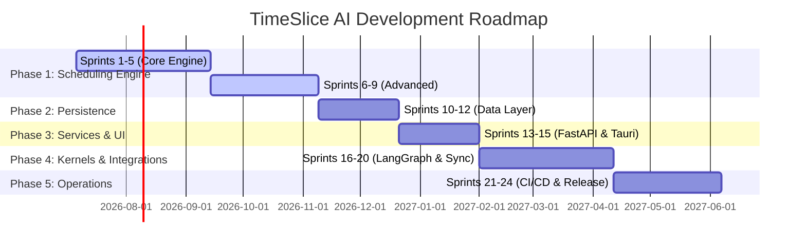

# TimeSlice AI - Development Roadmap & Sprints 🚀

This document details the step-by-step engineering roadmap for building **TimeSlice AI**. It outlines the workload division between **Developer A (Frontend)** and **Developer B (Backend & AI)** for all 5 phases and 24 sprints.

---

## 👥 Team Workload Division & Tech Stack

*   **Developer A (Frontend):** Focuses on Tauri, React, TypeScript, Tailwind CSS, Zustand, and TanStack Query.
*   **Developer B (Backend & AI):** Focuses on FastAPI, SQLAlchemy (SQLite), ChromaDB, LangGraph, and **Nvidia NIM API** (for LLM orchestration).

---

## 🗺️ High-Level Phase Timeline

---

## 📂 Phase 1: Pure Algorithmic Core (Sprints 1–9)
**Goal:** Build a pure, deterministic, and independently testable scheduling engine.
**Developer A (Frontend):** Set up design system tokens, components, and static mockups.
**Developer B (Backend):** Implement the core math, scheduling policies, and metrics in `packages/scheduling-system`.

### Part 1: Core Engine Components (Sprints 1–5)
*Target Namespace:* `packages/scheduling-system/` & `packages/ui/` (boilerplate)

#### Sprint 1: Engine Core Foundation
*   **Developer B (Backend):**
    *   Define shared domain scheduling models (`Process`, `TimeSlice`, `ExecutionPlan`).
    *   Define scheduler interfaces (`ISchedulerPolicy`, `IConstraintEngine`).
    *   Build the `Process Analyzer` to parse input workloads.
    *   Set up unit testing boilerplate in `tests/`.
*   **Developer A (Frontend):**
    *   Initialize Tauri project configuration and template shell.
    *   Define theme design tokens (colors, typography, spacings) in CSS variables.

#### Sprint 2: Policy Manager & Initial Policies
*   **Developer B (Backend):**
    *   Build the central `Policy Manager` for registerable policies.
    *   Implement deterministic `Round Robin` and `Priority Scheduling` policies.
    *   Write policy verification unit tests.
*   **Developer A (Frontend):**
    *   Build foundational UI components (Button, Typography, Input, Card, Tooltip).
    *   Establish UI Storybook or playground for component validation.

#### Sprint 3: Time Quantum & Planning
*   **Developer B (Backend):**
    *   Build the `Time Quantum Manager` to calculate dynamic/static execution slices.
    *   Implement `Execution Planner` to assemble individual time slices into a contiguous execution plan.
*   **Developer A (Frontend):**
    *   Design and build static layout wrappers (Sidebar, Header, Main view area).
    *   Create mock views for the Dashboard.

#### Sprint 4: Rescheduling & Resolution
*   **Developer B (Backend):**
    *   Build the `Conflict Resolver` to handle overlapping calendar constraints.
    *   Implement the `Dynamic Rescheduler` for local replanning when interrupts occur.
*   **Developer A (Frontend):**
    *   Build static layouts for Process CRUD views (creation forms, status lists).
    *   Implement client-side state routing (React Router or simpler switcher).

#### Sprint 5: Simulation & Core Testing
*   **Developer B (Backend):**
    *   Build the `Scheduler Simulator` to run virtual scheduling runs.
    *   Write integration test suites verifying plan generation under simulated workloads.
*   **Developer A (Frontend):**
    *   Build interactive state stores (Zustand) with local dummy data.
    *   Create prototype calendar grid UI components.

---

### Part 2: Advanced Scheduling (Sprints 6–9)
*Target Namespace:* `packages/scheduling-system/` & `packages/ui/` (widgets)

#### Sprint 6: Constraint Engine
*   **Developer B (Backend):**
    *   Implement `Constraint Engine` structure.
    *   Define `HardConstraint` (e.g. fixed events) and `SoftConstraint` (e.g. preferred work hours) interfaces.
    *   Build constraint verification algorithms.
*   **Developer A (Frontend):**
    *   Create UI controls for configuring schedule constraints (sliders, time range pickers).

#### Sprint 7: Advanced Policies
*   **Developer B (Backend):**
    *   Implement `Shortest Job First (SJF)` and `Earliest Deadline First (EDF)` scheduling policies.
    *   Write unit tests validating policy outputs.
*   **Developer A (Frontend):**
    *   Build policy selector components in the UI.
    *   Design cards showing detail explanations of selected policies.

#### Sprint 8: Dynamic Rescheduling
*   **Developer B (Backend):**
    *   Implement the `Dynamic Rescheduler` localized update pipeline.
    *   Build `Impact Analyzer` to evaluate the cognitive impact of rescheduling.
*   **Developer A (Frontend):**
    *   Design interactive dialog prompts for handling rescheduling impacts (e.g., "Review rescheduling conflict").

#### Sprint 9: Scheduling Metrics & Simulator
*   **Developer B (Backend):**
    *   Implement `Attention Debt`, `Attention Equity`, `Deadline Risk`, and `Completion Velocity` metrics.
    *   Implement aggregated `Process Health` computation.
    *   Build policy comparison simulator engine.
*   **Developer A (Frontend):**
    *   Build visualization components for metrics (health status rings, velocity charts using Recharts).

---

## 🗄️ Phase 2: Persistence & Local Storage (Sprints 10–12)
**Goal:** Build the local-first database architecture and memory RAG engines.
**Developer A (Frontend):** Implement offline Zustand state caches and client-side database caching.
**Developer B (Backend):** Configure SQLite repositories and ChromaDB embeddings.

*Target Namespace:* `packages/database/` & `packages/context-vault/`

#### Sprint 10: Relational Schema & Repositories
*   **Developer B (Backend):**
    *   Define SQLAlchemy database models mapping to processes, execution plans, and metrics.
    *   Build repositories for atomic data operations.
    *   Configure Alembic database migration environment.
*   **Developer A (Frontend):**
    *   Implement client-side storage persistence strategies for UI preferences.

#### Sprint 11: Local Database & Vector Store
*   **Developer B (Backend):**
    *   Integrate SQLite database drivers for offline-first relational persistence.
    *   Integrate ChromaDB vector database drivers.
    *   Build vector embedding pipeline for document retrieval.
    *   Create schema migrations.
*   **Developer A (Frontend):**
    *   Create offline warning state UI layers and local cache managers.

#### Sprint 12: Sync Interfaces & Offline Engine
*   **Developer B (Backend):**
    *   Build sync schemas and transaction logs.
    *   Define PostgreSQL cloud synchronization contracts and conflict resolution strategies.
*   **Developer A (Frontend):**
    *   Design the conflict resolution UI panel where users select overrides during sync.

---

## 🔌 Phase 3: Core API Services & Frontend Shell (Sprints 13–15)
**Goal:** Connect the core backend system to web layers and launch API interfaces.
**Developer A (Frontend):** Implement client API connections, Zustand integration, and dynamic routing.
**Developer B (Backend):** Build FastAPI routing, validation DTOs, and resource endpoints.

*Target Namespace:* `apps/backend/` & `apps/desktop/`

#### Sprint 13: FastAPI Infrastructure
*   **Developer B (Backend):**
    *   Set up FastAPI project boilerplate, configuration handlers, and basic routing.
    *   Set up DTO schemas and request body validators.
*   **Developer A (Frontend):**
    *   Initialize Axios/Fetch API client hooks.
    *   Setup TanStack Query provider structure.

#### Sprint 14: Core Resource API Endpoints
*   **Developer B (Backend):**
    *   Build Process CRUD API endpoints.
    *   Build Scheduler API endpoints to fetch execution plans.
    *   Expose Calendar synchronization endpoints.
*   **Developer A (Frontend):**
    *   Bind the Process management UI forms with backend POST/PUT/DELETE endpoints.
    *   Render active scheduler execution plans in the calendar grid.

#### Sprint 15: Security & Kernel Endpoint
*   **Developer B (Backend):**
    *   Implement JWT token validation and secure headers middleware.
    *   Set up Attention Kernel communication API stub endpoints.
*   **Developer A (Frontend):**
    *   Implement client-side API authentication interceptors.
    *   Bind Zustand stores to the API query responses.

---

## 🤖 Phase 4: Agentic Attention Kernel & Platform (Sprints 16–20)
**Goal:** Build the LangGraph AI multi-agent kernel using Nvidia NIM and integrate platform services.
**Developer A (Frontend):** Implement the AI Chat assistant view and calendar bindings.
**Developer B (Backend):** Implement multi-agent workflows, Cognito, Google/Apple Calendars, and notifications.

*Target Namespace:* `packages/attention-kernel/` & `packages/platform/`

#### Sprint 16: Authentication & Cognito
*   **Developer B (Backend):**
    *   Integrate AWS Cognito SDK.
    *   Implement JWT verification and session validation.
*   **Developer A (Frontend):**
    *   Create login/signup user interface flows.
    *   Bind authentication state to secure local storage.

#### Sprint 17: External Calendar Integrations
*   **Developer B (Backend):**
    *   Build Google Calendar OAuth adapter.
    *   Build Apple Calendar adapter.
    *   Implement background calendar sync jobs.
*   **Developer A (Frontend):**
    *   Create settings interface options to log in to third-party calendars.

#### Sprint 18: Notification Engines
*   **Developer B (Backend):**
    *   Build local desktop notifications provider.
    *   Integrate Telegram Bot SDK for sending schedule updates.
*   **Developer A (Frontend):**
    *   Design Notification configuration widgets in the settings page.

#### Sprint 19: LangGraph Agentic Attention Kernel (Nvidia NIM)
*   **Developer B (Backend & AI):**
    *   Set up LangGraph orchestrator using **Nvidia NIM SDK** (integrating models like Llama-3, Mixtral, or Nemotron as configured via NIM).
    *   Define agent roles (Process Agent, Scheduling Agent, Calendar Agent).
    *   Build tool registries connecting agent nodes to local API services.
*   **Developer A (Frontend):**
    *   Implement chat container interface with streaming response support.
    *   Design AI recommendation inline components (accept/reject buttons on schedule adjustments).

#### Sprint 20: Background Operations & Cloud Sync
*   **Developer B (Backend):**
    *   Set up Celery/Arq background task workers.
    *   Implement PostgreSQL cloud database synchronizer client.
    *   Configure Secrets manager.
*   **Developer A (Frontend):**
    *   Create sync status indicator icons and system health alert elements.

---

## 📦 Phase 5: Operations & Production Readiness (Sprints 21–24)
**Goal:** Pack client builds, set up CI/CD, and establish production monitoring.
**Developer A (Frontend):** Package Tauri binaries for OS targets, configure build scripts.
**Developer B (Backend):** Configure Docker Compose, deployment networks, and logging.

*Target Namespace:* `deployment/` (infrastructure, CI/CD, scripting)

#### Sprint 21: Containerization & Environments
*   **Developer B (Backend):**
    *   Write development, staging, and production Dockerfiles.
    *   Build Docker Compose environments for local multi-service staging.
*   **Developer A (Frontend):**
    *   Configure Tauri build parameters for production installers (.msi, .dmg, .deb).

#### Sprint 22: CI/CD Pipeline
*   **Developer B (Backend):**
    *   Create GitHub Actions workflows for backend testing and container builds.
*   **Developer A (Frontend):**
    *   Set up GitHub Actions workflows to build and release production Tauri binaries.

#### Sprint 23: Observability & Logging
*   **Developer B (Backend):**
    *   Set up structured JSON loggers.
    *   Integrate system health telemetry endpoints.
*   **Developer A (Frontend):**
    *   Integrate crash reporting analytics on the desktop client.

#### Sprint 24: Release & Deployment
*   **Developer B (Backend):**
    *   Create database backup & recovery scripts.
    *   Deploy production FastAPI backend.
*   **Developer A (Frontend):**
    *   Validate production Tauri client installations on target devices.

---

---

# 🔄 Execution Plan: 21% → 100% MVP Completion

> This section was added after the initial roadmap based on a thorough gap analysis against the PRD Design Bible. It covers all remaining work required to reach a shippable V1.0.

---

## Overview

Organized into **7 Phases** and **25 Milestones** in strict dependency order per PRD §"Development Order":
Shared Models → Database → Process System → Scheduling System → Execution System → Desktop UI → Calendar → Attention Kernel → Adaptive Intelligence → Analytics → Notifications → Cloud.

| Phase | Focus | PRD Chapters | Target Completion |
|---|---|---|---|
| 0 | Stabilize & Clean Foundation | §17 | 25% |
| 1 | Scheduling Engine Completion | §16, §8.2 | 40% |
| 2 | Analytics System | §8.9 | 52% |
| 3 | Execution System + Dashboard | §8.6, §13 | 65% |
| 4 | Context Vault + Kernel Upgrade | §8.3, §8.5, §15 | 78% |
| 5 | Adaptive Intelligence | §8.4, §15.21–15.25 | 88% |
| 6 | Calendar + Notifications + Auth | §8.7, §8.8, §8.10 | 96% |
| 7 | Testing + Performance + CI/CD | §9 | 100% |

---

## 🧹 Phase 0: Stabilize & Clean Foundation (Prerequisite)

**Goal:** Eliminate hardcoded test data, fix DB schema gaps, and ensure existing code correctly reflects the domain model before building new systems.

> ⚠️ Must complete before any new feature work begins. Building on fake data corrupts all future analytics, metrics, and adaptive learning.

### Milestone 0.1 — Remove Hardcoded Test Data

- **[DONE]** `process-store.ts`: Replace `initialProcesses` (5 fake processes) with `[]`
- `timeline.tsx`: Remove hardcoded events array; wire to `/api/v1/scheduler/plan`
- `insights.tsx`: Remove all hardcoded bar data, focus hours, "12 day streak"; wire to `/api/v1/analytics/metrics`
- `recommendation-card.tsx`: Remove hardcoded recommendation; wire to `/api/v1/scheduler/recommendation`
- **[NEW]** `onboarding.tsx`: Empty state shown when user has 0 processes

### Milestone 0.2 — Database Schema Alignment (PRD §17.4)

Add missing tables to SQLAlchemy models:
- `time_slices`: `id, execution_plan_id, process_id, start_time, end_time, status, reflection, progress_gained`
- `checklists`: `id, timeslice_id, title, completed, order`
- `analytics`: `process_id, attention_debt, attention_equity, deadline_risk, completion_velocity, process_health`
- `adaptive_profiles`: `operator_id, preferred_policy, preferred_quantum, working_hours, notification_prefs`
- `operator_models`: `operator_id, focus_duration, switch_tolerance, consistency_score, velocity_score`
- `notifications_log`: `id, operator_id, type, payload, sent_at, channel`
- Alembic migration pipeline setup

---

## ⚙️ Phase 1: Scheduling Engine Completion (PRD §16)

**Goal:** Complete the 5 missing Scheduling Engine components that are partially stubbed or absent.

### Milestone 1.1 — Constraint Engine (PRD §16.5)
- `constraints/constraint_engine.py`: `build(processes, calendar, prefs) -> ConstraintPackage`
- `constraints/hard_constraints.py`: RestPeriod, ExistingCalendarEvent, HardDeadline, MaxDailyHours
- `constraints/soft_constraints.py`: PreferredWorkingHours, PreferredContextSwitching, PreferredQuantum

### Milestone 1.2 — Time Quantum Manager (PRD §16.7)
- `quantum/quantum_manager.py`: `allocate(prefs, constraints) -> TimeQuantum`, `split_into_windows(quantum, calendar) -> List[ExecutionWindow]`
- Hours vs. Days mode; min 30 min, max configurable; no overlaps; respect hard constraints

### Milestone 1.3 — Execution Plan Generator & Conflict Resolver (PRD §16.8)
- `planner/execution_window.py`: `start_time, end_time, process_id, quantum_id`
- `planner/execution_plan.py`: full PRD schema with version, explanation tokens, validation status
- `conflicts/conflict_resolver.py`: `validate(plan)`, `detect_overlaps()`, `auto_resolve()`, `escalate_to_operator()`

### Milestone 1.4 — Dynamic Rescheduler (PRD §16.9)
- `rescheduler/dynamic_rescheduler.py`: `recompute(current_plan, scheduling_event) -> ExecutionPlan`
  - Minimum Disruption Principle: only update affected regions
- `rescheduler/impact_analyzer.py`: Determines affected Time Slices from a scheduling event

### Milestone 1.5 — Scheduling Metrics (PRD §16.10–16.11)
Complete all metric computations:
- `attention_debt.py`: `compute(process, last_slice_date, remaining_effort, deadline) -> float`
- `attention_equity.py`: `compute(consecutive_successes, completion_velocity) -> float`
- `deadline_risk.py`: `compute(...) -> Low | Moderate | High | Critical`
- `completion_velocity.py`: `compute(history, rolling_window=7) -> float`
- `process_health.py`: `compute(...) -> ProcessHealth` (Excellent/Good/Fair/Needs Attention/Critical, 0–100)

### Milestone 1.6 — Scheduler Simulator & Service Interface (PRD §16.12–16.13)
- `simulator/simulator.py`: `simulate(policy, processes, constraints) -> SimulationResult`, `compare_policies(...) -> List[SimulationResult]`
- `services/scheduling_service.py` (full public interface):
  - `generate_execution_plan(processes, calendar, preferences, policy) -> ExecutionPlan`
  - `recompute_execution_plan(current_plan, event) -> ExecutionPlan`
  - `simulate_policy(policy, processes, constraints) -> SimulationResult`
  - `validate_execution_plan(plan) -> ValidationResult`
  - `compute_metrics(execution_history, process_history) -> SchedulingMetrics`

### Milestone 1.7 — Auto-Reschedule on Process Changes
- `processes.py` router: After CREATE/UPDATE/PAUSE/RESUME/DELETE → fire `SchedulingEvent` to `DynamicRescheduler`
- Return updated `ExecutionPlan` alongside process mutation response

### Milestone 1.8 — New Backend Scheduler API Endpoints
- `GET /api/v1/scheduler/recommendation` → top recommended process + policy + explanation
- `GET /api/v1/scheduler/simulate` → all 4 policies through simulator
- `POST /api/v1/scheduler/recompute` → triggers dynamic rescheduler

---

## 📊 Phase 2: Analytics System (PRD §8.9)

**Goal:** Build the real analytics pipeline. Replace all hardcoded dashboard data with live computed metrics.

### Milestone 2.1 — Analytics System Core
- `packages/analytics-system/analytics_system/services/analytics_service.py`
- `processors/`: health_processor, debt_processor, equity_processor, velocity_processor
- `reports/weekly_summary.py`
- API: `GET /api/v1/analytics/metrics`, `/health/{id}`, `/focus-streak`, `/time-allocation`, `/weekly-summary`

### Milestone 2.2 — Wire Frontend Analytics
- `pages/analytics.tsx`: Full analytics dashboard (health distribution, debt/equity trends, time allocation pie)
- `insights.tsx`: Wire to live API with skeleton loaders
- `recommendation-card.tsx`: Real scheduler recommendation with Accept/Reject actions
- New stores: `analytics-store.ts`, `recommendation-store.ts`

---

## 🎯 Phase 3: Execution System & Time Slice Loop (PRD §8.6)

**Goal:** Build the daily work loop — Time Slice management, Process Checklists, Reflections.

### Milestone 3.1 — Execution System Core
- `packages/execution-system/execution_system/services/execution_service.py`
- `time_slice/time_slice_manager.py`: `start_time_slice`, `complete_time_slice`, `abandon_time_slice`
- `checklists/checklist_generator.py`: Generates items from process state
- `reflection/reflection_handler.py`: Saves reflection, triggers analytics update

### Milestone 3.2 — Execution API
- `POST /api/v1/slices/start`, `/complete`, `/abandon`
- `GET|POST /api/v1/slices/{id}/checklists`, `PATCH /api/v1/slices/{id}/checklists/{item_id}`

### Milestone 3.3 — Dashboard Process Workspace (Frontend)
- `dashboard.tsx`: Today's Recommended Process, Active Time Slice timer + checklist, Process Health rings, Upcoming Windows, Kernel Recommendations panel
- `time-slice-panel.tsx`: Active timer, inline checklist, Complete/Abandon buttons
- `reflection-modal.tsx`: Post-session reflection form
- `processes.tsx`: Per-process progress, health badge, Attention Debt/Equity, time slice history, notes

---

## 🤖 Phase 4: Context Vault & Attention Kernel Upgrade (PRD §8.3, §8.5, §15)

**Goal:** Build the full LangGraph multi-agent Kernel with all 5 specialist agents, Context Vault with RAG, and Tool Execution Service.

### Milestone 4.1 — Context Vault (PRD §15.11–15.14)
- `packages/context-vault/context_vault/services/context_service.py`
- `embeddings/embedding_generator.py`, `retrieval/retriever.py`, `retrieval/ranker.py`
- `vector_store/chroma_client.py`
- `ContextPackage` dataclass (relevant processes, docs, reflections, confidence)

### Milestone 4.2 — Tool Registry & Tool Execution Service (PRD §15.16–15.19)
- `tools/registry.py`, `tools/executor.py`
- `tools/process_tools.py`, `scheduling_tools.py`, `calendar_tools.py`, `execution_tools.py`, `analytics_tools.py`, `context_tools.py`, `notification_tools.py`
- Standard tool response: `{status, tool, message, data, execution_time_ms}`

### Milestone 4.3 — Multi-Agent LangGraph Architecture (PRD §15.3–15.10)
- `agent_kernel.py` → LangGraph Supervisor with routing node
- `agents/`: process_agent, scheduling_agent, calendar_agent, execution_agent, reflection_agent
- `prompts/`: One prompt file per agent, version-controlled
- Graph: `START → routing → supervisor → [5 agents] → tool_executor → core_systems`

### Milestone 4.4 — Kernel Chat Frontend Upgrades
- Show active specialist agent per response
- Structured recommendation cards (accept/modify/reject)
- Conversation history via `GET /api/v1/chat/history`
- Streaming SSE for real-time token output

---

## 🧠 Phase 5: Adaptive Intelligence Layer (PRD §8.4, §15.21–15.25)

**Goal:** Build the Contextual Bandit learning engine for personalized scheduling.

### Milestone 5.1 — Adaptive Intelligence System
- `packages/adaptive-intelligence/adaptive_intelligence/`
- `contextual_bandits/bandit_engine.py`: LinUCB/epsilon-greedy contextual bandit
- `operator_model/operator_model.py`: Tracks behavior (focus_duration, switch_tolerance, velocity)
- `adaptive_profile/adaptive_profile.py`: Tracks preferences (policy, quantum, hours)
- `reward/reward_engine.py`: Composite reward (acceptance +1.0, slice_completed +0.8, process_completed +2.0, abandoned -1.0, missed_deadline -2.0)
- `learning_pipeline/learning_pipeline.py`: Observation → learning event pipeline
- `recommendation/recommendation_engine.py`: AdaptiveProfile + Bandit → RecommendationPackage

### Milestone 5.2 — Wire Learning to Reflection & Kernel
- `reflection_agent.py`: After reflection → `LearningPipeline.observe()` → `RewardEngine.compute()` → bandit update → Context Vault store
- `scheduling_agent.py`: Before plan generation → `RecommendationEngine.get_recommendation()` → inject into scheduling decision

### Milestone 5.3 — Adaptive Profile API & Settings UI
- `GET|PUT /api/v1/adaptive/profile`, `GET /api/v1/adaptive/operator-model`
- `settings.tsx`: "Adaptive Profile" section with learned preferences + override controls

---

## 📅 Phase 6: Calendar, Notifications & Auth (PRD §8.7, §8.8, §8.10)

**Goal:** Build real external integrations as specified in MVP.

### Milestone 6.1 — Calendar System (PRD §8.7)
- `integrations/google/google_calendar.py`: Google Calendar API OAuth client
- Calendar API: `POST /api/v1/calendar/sync/google`, `GET|POST|PUT|DELETE /api/v1/calendar/events`
- `calendar.tsx`: Execution Windows from real plan, Google events overlay, drag-drop reschedule, Rest Period blocking

### Milestone 6.2 — Notification System (PRD §8.8)
- `packages/notification-system/notification_system/`
- `channels/desktop_notifier.py` (Tauri notifications), `channels/telegram_notifier.py`
- `scheduler/reminder_scheduler.py`: APScheduler jobs for Time Slice reminders, reflection prompts, deadline alerts, weekly summary
- `apps/backend/main.py`: Add APScheduler background jobs

### Milestone 6.3 — Real Authentication (PRD §8.10)
- Replace mock Cognito overlay with real AWS Cognito integration
- `POST /api/v1/auth/login|refresh|logout`
- JWT middleware for all protected endpoints

---

## ✅ Phase 7: Production Quality & CI/CD (PRD §9)

**Goal:** Meet all Non-Functional Requirements from PRD §9.

### Milestone 7.1 — Test Suite
- Backend unit tests: all scheduling algorithms, analytics metrics, constraint engine
- Backend integration tests: all API routes
- Frontend tests: Zustand stores (no hardcoded data), critical flow components

### Milestone 7.2 — Performance Compliance (PRD §9)
- Schedule generation ≤ 1 second for 100 active Processes
- AI responses ≤ 5 seconds
- App startup ≤ 3 seconds
- Performance benchmarks in CI

### Milestone 7.3 — Cloud Sync
- Complete Sync Engine: bidirectional SQLite ↔ PostgreSQL
- Conflict resolution: latest-write-wins with manual override
- Wire `sync_conflict_panel.tsx` to real backend sync events

### Milestone 7.4 — CI/CD Completion
- `.github/workflows/backend-ci.yml`: pytest, linting on every PR
- `.github/workflows/release.yml`: Version tag triggers → GitHub Release with installers
